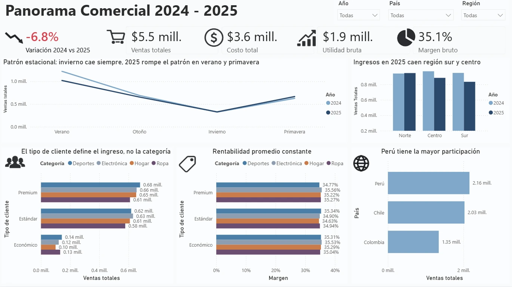
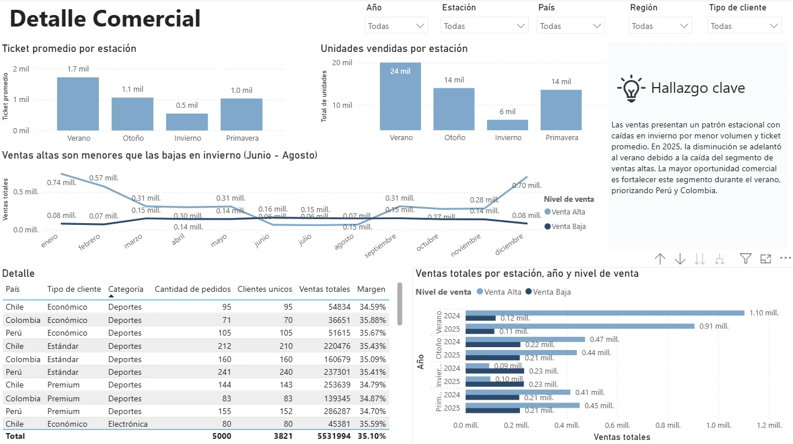

# Dashboard de desempeño comercial | Andes Retail Group

## Resumen ejecutivo del proyecto

**Objetivo:** analizar el desempeño comercial de **Andes Retail Group** durante 2024–2025 mediante un dashboard interactivo en **Power BI**, con el propósito de identificar cambios en ventas, rentabilidad, comportamiento de clientes, diferencias geográficas y patrones estacionales que ayuden a detectar oportunidades comerciales.

El análisis encontró una **caída de 6.8% en las ventas de 2025 respecto a 2024**, equivalente a aproximadamente **$194,774 menos en ingresos**, mientras que el margen bruto se mantuvo estable alrededor del **35.1%**.

El principal hallazgo fue que la disminución no se explica por una caída general de la rentabilidad ni únicamente por la estacionalidad habitual del negocio. El mayor deterioro se concentró en las **ventas altas durante el verano**, especialmente en las regiones **Centro y Sur**, afectando con mayor impacto a **Perú**, el país con mayor participación en los ingresos.

> Este README presenta los principales **resultados, visualizaciones e insights de negocio**.
> La planificación del dashboard, construcción de métricas y narrativa completa mediante el modelo **SCQA** se encuentran en [`Proyecto_de_Desempeno_Comercial.ipynb`](./Proyecto_de_Desempeno_Comercial.ipynb).

---

## Tabla de contenido

* [Tecnologías utilizadas](#tecnologias)
* [Contexto y preparación de los datos](#contexto)
* [Resultado principal: las ventas disminuyeron 6.8%](#resultado-principal)
* [Overview ejecutivo](#overview)
* [Análisis detallado](#detalle)
* [Principales hallazgos](#hallazgos)
* [Conclusión y recomendaciones de negocio](#conclusion)

---

## Tecnologías utilizadas

`Power BI` · `Power Query` · `DAX` · `Excel` · `Jupyter Notebook`

**Técnicas aplicadas:** preparación y validación de datos, creación de métricas comerciales, análisis de ventas y rentabilidad, segmentación de clientes, análisis geográfico, análisis de estacionalidad, diseño de dashboards interactivos, storytelling y narrativa ejecutiva mediante el modelo **SCQA**.

[↑ Volver al inicio](#inicio)

---

## Contexto y preparación de los datos

**Andes Retail Group** es una empresa de retail con operaciones en:

* 🇵🇪 Perú
* 🇨🇱 Chile
* 🇨🇴 Colombia

La empresa comercializa productos de cuatro categorías:

* Electrónica
* Ropa
* Deportes
* Hogar

El dataset contiene información transaccional de **2024 y 2025**, incluyendo pedidos, clientes, ubicación geográfica, categoría de producto, unidades vendidas, precios, ingresos y costos.

Durante la preparación de los datos se realizaron, entre otras, las siguientes tareas:

* Validación de tipos de datos.
* Ajuste y tratamiento de la variable de fecha.
* Revisión de la calidad y consistencia de las columnas.
* Creación de la variable **`Nivel_Venta`**:

  * `Venta Alta`: ingresos ≥ $1,000.
  * `Venta Baja`: ingresos < $1,000.
* Creación de la métrica **Utilidad**, calculada como:

`Utilidad = Ingresos - Costos`

Se diseñaron dos páginas complementarias:

1. **Panorama Comercial:** visión ejecutiva del desempeño general.
2. **Detalle Comercial:** análisis de las causas, patrones y oportunidades detrás de los resultados.

[↑ Volver al inicio](#inicio)

---

## Resultado principal: las ventas disminuyeron 6.8%

| Indicador                |      Resultado |
| ------------------------ | -------------: |
| Ventas totales 2024–2025 | **$5.5 mill.** |
| Costo total              | **$3.6 mill.** |
| Utilidad bruta           | **$1.9 mill.** |
| Margen bruto             |      **35.1%** |
| Variación 2024 vs. 2025  |      **-6.8%** |
| Disminución aproximada   |  **-$194,774** |

Aunque las ventas disminuyeron en 2025, el **margen bruto permaneció prácticamente estable alrededor del 35.1%**.

Esto permitió descartar inicialmente un deterioro generalizado de la rentabilidad y dirigir el análisis hacia otra pregunta:

> **¿Dónde y cuándo se produjo realmente la caída en los ingresos?**

[↑ Volver al inicio](#inicio)

---

## Panorama Comercial

La primera página del dashboard fue diseñada para proporcionar una **lectura ejecutiva del negocio en pocos segundos**.

Además de los principales KPI, permite comparar el comportamiento comercial por estación, región, país, segmento de cliente y categoría de producto.

### Principales observaciones

**1. Existe un patrón estacional claro.**

El **verano representa la temporada de mayores ingresos**, mientras que durante el **invierno las ventas alcanzan su nivel más bajo**.

Sin embargo, 2025 presenta una desviación importante: la caída anual no ocurrió principalmente durante la temporada baja, sino que se concentró en buena medida durante el **verano**, cuando normalmente deberían registrarse los mejores resultados.

---

**2. El segmento del cliente explica más el nivel de ingresos que la categoría del producto.**

Los clientes **Premium** y **Estándar** generan considerablemente más ingresos que el segmento **Económico**.

En cambio, dentro de cada segmento las diferencias entre Electrónica, Deportes, Hogar y Ropa son relativamente pequeñas.

**Insight:** el valor comercial del cliente tiene mayor influencia sobre los ingresos que la categoría de producto adquirida.

---

**3. La rentabilidad es estable entre categorías y segmentos.**

Los márgenes se mantienen aproximadamente alrededor del **35%**, sin diferencias suficientemente grandes como para explicar la disminución de ventas de 2025.

**Insight:** el principal problema comercial observado está relacionado con el **nivel de ventas**, no con una pérdida significativa de margen.

---

**4. Perú tiene la mayor participación en los ingresos.**

Los ingresos acumulados por país son aproximadamente:

| País     |          Ventas |
| -------- | --------------: |
| Perú     | **$2.16 mill.** |
| Chile    | **$2.03 mill.** |
| Colombia | **$1.35 mill.** |

Debido a su participación, cualquier deterioro comercial en Perú tiene un impacto proporcionalmente mayor sobre el resultado consolidado de Andes Retail Group.

[↑ Volver al inicio](#inicio)

---

## Detalle Comercial

Después de identificar la caída en el Overview, la segunda página fue diseñada para responder:

> **¿Qué está provocando la disminución de los ingresos?**

Para ello se analizó conjuntamente el **ticket promedio**, las **unidades vendidas**, el nivel de venta, la estación del año y la evolución mensual.

### Comportamiento estacional

El verano presenta simultáneamente:

* Mayor ticket promedio.
* Mayor volumen de unidades vendidas.
* Mayor participación de ventas clasificadas como altas.

En invierno ocurre el comportamiento contrario:

* Disminuye el número de unidades vendidas.
* Disminuye el ticket promedio.
* Las ventas altas caen fuertemente.

Por lo tanto, la disminución invernal forma parte de un **patrón estacional consistente**.

---

### El problema aparece durante la temporada alta

La caída más relevante aparece al comparar el verano de ambos años.

Las ventas de verano pasaron aproximadamente de:

**$1,222,301 en 2024 → $1,019,418 en 2025**

lo que representa una disminución aproximada del:

**-16.5%**

Este comportamiento resulta particularmente importante porque ocurre durante la temporada que normalmente genera los mayores ingresos.

---

### Las ventas altas explican buena parte de la caída

Al separar las operaciones entre **Ventas Altas** y **Ventas Bajas**, se observa que las ventas bajas presentan un comportamiento relativamente estable.

El cambio más importante aparece en el segmento de **Ventas Altas**, que pierde volumen durante 2025 y rompe el comportamiento esperado durante el verano.

El análisis geográfico permitió observar que la disminución se concentra especialmente en las regiones:

**Centro y Sur**

y afecta con mayor impacto al resultado consolidado de **Perú**, debido a que este país representa la mayor participación de los ingresos del grupo.

[↑ Volver al inicio](#inicio)

---

## Principales hallazgos

El análisis permitió sintetizar el comportamiento comercial en cinco conclusiones:

1. **Las ventas de 2025 disminuyeron 6.8% respecto a 2024**, aproximadamente $194,774.

2. **El margen bruto permanece estable alrededor del 35.1%**, por lo que la caída no parece originarse en un deterioro general de la rentabilidad.

3. Existe una **estacionalidad clara**: verano es la temporada más fuerte e invierno la más débil.

4. La principal anomalía de 2025 aparece precisamente en **verano**, cuando las ventas disminuyeron aproximadamente **16.5%** frente al verano anterior.

5. La caída se concentra principalmente en el segmento de **ventas altas**, especialmente en las regiones **Centro y Sur**, con un impacto relevante en **Perú** debido a su mayor participación en los ingresos.

[↑ Volver al inicio](#inicio)

---

## Conclusión y recomendaciones de negocio

### Conclusión

El desempeño de Andes Retail Group muestra que la disminución de ventas de 2025 **no corresponde únicamente al patrón estacional habitual**.

La empresa conserva una rentabilidad relativamente estable, pero presenta una pérdida de ingresos concentrada en un segmento específico: las **ventas de mayor valor durante la temporada de verano**.

Esto convierte el problema en una oportunidad de análisis comercial mucho más específica que una caída general del mercado.

### Recomendaciones

**1. Priorizar la revisión comercial de las ventas altas en las regiones Centro y Sur.**

El análisis debería comenzar por las áreas donde se concentra la desviación observada, especialmente durante los meses correspondientes al verano.

**2. Profundizar el análisis de Perú y Colombia.**

Por su peso comercial, Perú merece especial atención, mientras que la segmentación geográfica puede ayudar a identificar si existe un comportamiento similar en Colombia.

**3. Investigar la causa raíz de la disminución.**

El dataset permite localizar el problema, pero no contiene información suficiente para determinar su causa específica. Se recomienda complementar el análisis con variables relacionadas con:

* precios y promociones,
* disponibilidad de inventario,
* campañas comerciales,
* competencia,
* canales de venta,
* y cambios operativos durante el período.

**4. Monitorear el próximo verano.**

Si la disminución de las ventas altas vuelve a repetirse durante la siguiente temporada alta, existiría mayor evidencia de que se trata de un cambio estructural y no de un evento puntual.

---

### Conclusión ejecutiva

**Andes Retail Group mantiene márgenes estables, pero perdió 6.8% de sus ventas en 2025. El principal foco no está en la rentabilidad ni en la temporada baja, sino en la caída de las ventas de mayor valor durante el verano, especialmente en las regiones Centro y Sur.**

El dashboard permite pasar de observar una disminución general de ingresos a **identificar dónde concentrar la investigación y las acciones comerciales**.

---

## Archivos del proyecto

* [`Proyecto_de_Desempeno_Comercial.ipynb`](./Proyecto_de_Desempeno_Comercial.ipynb) — documentación, planificación y narrativa SCQA.
* [`Andes_Retail_Group_2024_2025.xlsx`](./datasets/Andes_Retail_Group_2024_2025.xlsx) — dataset utilizado.
* [`Andes_Retail_Group_2024_2025_PDRP.pbix`](./Andes_Retail_Group_2024_2025_PDRP.pbix) — dashboard desarrollado en Power BI.
* [`assets/Panorama_comercial.png`](./assets/Panorama_comercial.png) — vista ejecutiva.
* [`assets/Detalle_comercial.png`](./assets/Detalle_comercial.png) — vista de análisis detallado.

[↑ Volver al inicio](#inicio)
